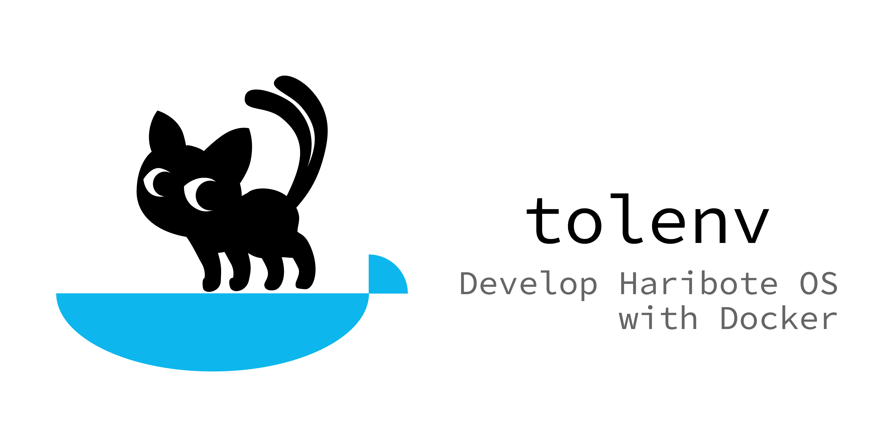

[Japanese](./README.md) | **中文**

# tolenv



这是一个支持 Docker 的各种环境的工具集。

它与 C 和汇编源代码级的由川合秀实撰写的《30 天自制操作系统》介绍的内容兼容，但是 Makefile 需要部分重写。我将创建一个有关如何重写的文档。

最后一天的 harib27f 根据此 tolenv 进行了重写，并以 [HariboteOS / harib27f](https://github.com/HariboteOS/harib27f) 的形式发布，因此请同时参考。

## 事前准备

需要安装以下内容。

- [Docker](https://www.docker.com/get-started)
- [QEMU](https://www.qemu.org)
  - 如果不需要仿真功能，则无需安装。
  
## 环境检查

如下所示执行命令时，如果显示版本信息，就可以了（下面的输出用于经过验证的环境，实际上可能略有不同）。

```
$ docker --version
Docker version 19.03.5, build 633a0ea
```
## 下载并解压缩

克隆此存储库或将其下载为 zip 文件并解压缩。下面以文档（“ README.md”）所在的层次结构作为项目根目录进行了说明。

- / 项目根目录
  - Makefile
  - README.md
  - harib27f/
  - z_tools/
  - z_tools_linux/
  
## 获取 Docker 映像
获取运行开发工具所需的 Docker 映像。克隆或下载存储库后，只需执行一次此过程。无论您运行它多少次，都不会受到伤害。

* 打开一个终端并 cd 到项目根目录
* `make pull`

示例执行结果如下所示。

```
$ make pull
Using default tag: latest
latest: Pulling from hikalium/ubuntu-with-libc-i386
423ae2b273f4: Already exists 
de83a2304fa1: Already exists 
f9a83bce3af0: Already exists 
b6b53be908de: Already exists 
5b278adba46d: Pull complete 
e3c3960e082b: Pull complete 
Digest: sha256:100dffd9bbf940f1ed9e413927ee12ebfa096bcec00148e94d2ac9b0cf4e0d7a
Status: Downloaded newer image for hikalium/ubuntu-with-libc-i386:latest
docker.io/hikalium/ubuntu-with-libc-i386:latest
```

如果 docker image 已经拉出，则将获得以下输出。

```
$ make pull
Using default tag: latest
latest: Pulling from hikalium/ubuntu-with-libc-i386
Digest: sha256:100dffd9bbf940f1ed9e413927ee12ebfa096bcec00148e94d2ac9b0cf4e0d7a
Status: Image is up to date for hikalium/ubuntu-with-libc-i386:latest
docker.io/hikalium/ubuntu-with-libc-i386:latest
```

## 启动开发环境

此步骤不仅应在第一次执行，还应在每次 `make down` 或重新启动计算机时执行。（启动用于构建 Docker 容器。）

* 打开一个终端并 cd 到项目根目录
* `make up`

示例执行结果如下所示。

```
$ make up
b4d30d8e4c788a2f046eadf5417eec607f130504f4da512b3cc12dc5e068a869
OK!
```

如果已经启动，将返回以下响应。

```
$ make up
Already up
```

## 发展

在与 “z_tools/” 相同的层次结构中创建一个 OS 文件夹（例如：harib27f），然后像往常一样在该文件夹中进行开发。它与 C 和汇编源代码级的由川合秀实撰写的《30 天自制操作系统》介绍的内容兼容，但是 Makefile 需要部分重写。我将创建一个有关如何重写的文档。

## 开发环境结束

如果您已完成并想停止 Docker 容器，请按照以下步骤操作。

* 打开一个终端并 cd 到项目根目录
* `make down`

示例执行结果如下所示。

```
$ make down
tolenv
tolenv
tolenv container deleted
```

如果已经关闭，将返回以下响应。

```
$ make down
Error response from daemon: No such container: tolenv
Already down
```

# 致谢
至于项目图标，我从 hideyosi 的 [KaOS 资料集](http://osask.hideyosi.com/kaos/kaos.html) 下载了一个图标，并在 KL-01 许可下使用。

# 执照
MIT License